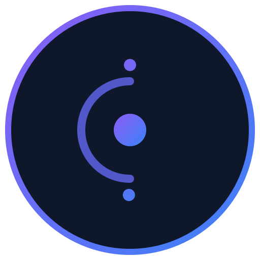

<p align="center">
  
</p>

<h1 align="center">Skill7</h1>
<p align="center"><em>Expert Skills for AI Agents</em></p>

<p align="center">
  <strong>634+ production-ready AI skills for any MCP-compatible client</strong>
</p>

<p align="center">
  <a href="https://www.npmjs.com/package/skill7"></a>
  <a href="https://abderraouf-yt.github.io/skills-mcp-server"></a>
  <a href="https://github.com/Abderraouf-yt/skills-mcp-server/releases"></a>
  <a href="https://github.com/Abderraouf-yt/skills-mcp-server/blob/main/LICENSE"></a>
  <a href="https://github.com/Abderraouf-yt/skills-mcp-server/stargazers"></a>
</p>

<p align="center">
  <a href="#-quick-start">Quick Start</a> •
  <a href="#-features">Features</a> •
  <a href="#-tools">Tools</a> •
  <a href="#-deployment">Deployment</a> •
  <a href="#-api">API</a>
</p>

---

## 💡 Why This Exists

**Stop searching. Start building.**

You spend hours searching for best practices, design patterns, and solutions. This MCP server gives your AI instant access to **634+ curated skills** covering:

- 🔐 **Security** — Penetration testing, vulnerability scanning, secure coding
- ⚛️ **Frontend** — React, Next.js, Vue, Angular, modern CSS
- 🐍 **Backend** — Python, Node.js, Go, Rust, API design
- ☁️ **Infrastructure** — Docker, Kubernetes, AWS, Terraform
- 🧠 **AI/ML** — LangChain, RAG, prompt engineering
- 📊 **Architecture** — System design, microservices, DDD

---

## ⚡ Quick Start

### One-Liner Setup

```bash
# Clone and install
git clone https://github.com/Abderraouf-yt/skills-mcp-server.git && cd skills-mcp-server
npm install && npm run build

# Configure your AI client (pick one)
npm run setup:gemini   # Gemini CLI
npm run setup:claude   # Claude Desktop / Code
npm run setup:cursor   # Cursor
npm run setup:all      # All clients
```

**Restart your AI client. Done.**

---

## 🎯 Features

<table>
<tr>
<td width="50%">

### 🚀 Universal Compatibility
Works with **any MCP client**:
- Gemini CLI
- Claude Desktop & Code
- Cursor
- VS Code Copilot
- Custom integrations

</td>
<td width="50%">

### � Premium UI Experience
Immersive, modern interface:
- **Interactive 3D Orb** background (OGL)
- **Glassmorphism** design system
- **Stable Grid Layout** with load-more
- **Mobile-first** responsive design

</td>
</tr>
<tr>
<td width="50%">

### 📚 634+ Skills
Curated, production-tested guidance:
- **Agentic Systems** & Orchestration
- **Generative AI** Engineering
- **Platform Engineering** practices
- **Web3 & Security** protocols

</td>
<td width="50%">

### 🔧 6 Tools + 2 Prompts
Everything you need:
- **Semantic Skill Matcher**
- **Workflow Generator**
- **Deep Skill Documentation**
- **Smart Categorization**

</td>
</tr>
</table>

---

## � Modern Skill Taxonomy (2026 Standard)

| Category | Skills | Highlights |
|----------|--------|------------|
| 🤖 **Agentic Systems** | 98 | Autonomous Agents, Swarms, Memory, Tool Use |
| 🧠 **Generative AI** | 85 | LLMs, Inference, Transformers, Prompt Eng |
| ☁️ **Platform Eng** | 72 | Cloud, Kubernetes, Terraform, Microservices |
| 🎨 **Product Exp** | 95 | Next.js, React, Mobile, Accessibility, UI/UX |
| �️ **Security** | 107 | DevSecOps, Red Teaming, Auth, Encryption |
| 🎮 **Game & 3D** | 45 | Unity, Three.js, OGL, WebGL, Shaders |
| � **Knowledge** | 60 | RAG, Vector DBs, Semantic Search |
| ⚡ **Automation** | 40 | Playwright, Crawlers, ETL Pipelines |
| � **Web3 Core** | 35 | Smart Contracts, DeFi, Solidity |


---

## 🌐 API Endpoints (HTTP Mode)

When running with `MCP_TRANSPORT=http`:

| Endpoint | Method | Description |
|----------|--------|-------------|
| `/` | GET | Server info & health |
| `/health` | GET | Health check |
| `/sse` | GET | MCP SSE connection |

**Environment Variables:**
- `PORT` — Server port (default: 3000)
- `MCP_TRANSPORT` — `stdio` or `http`

---

## 📦 Project Structure

```
skills-mcp-server/
├── src/
│   └── index.ts       # MCP server (dual transport)
├── data/
│   └── skills_index.json  # 634+ skills catalog
├── scripts/
│   └── setup.js       # One-click configurator
├── Dockerfile         # Production container
├── docker-compose.yml # Easy deployment
└── package.json
```

---

## 🤝 Contributing

We welcome contributions! See [CONTRIBUTING.md](CONTRIBUTING.md).

```bash
# Development
npm install
npm run dev    # Hot reload with tsx
```

---

## 📄 License

MIT © [Skill7](https://github.com/Abderraouf-yt)

---

<p align="center">
  <strong>Built for developers who ship.</strong>
</p>

<p align="center">
  <a href="https://github.com/Abderraouf-yt/skills-mcp-server">⭐ Star this repo</a> •
  <a href="https://github.com/Abderraouf-yt/skills-mcp-server/issues">Report Bug</a> •
  <a href="https://github.com/Abderraouf-yt/skills-mcp-server/issues">Request Feature</a>
</p>
